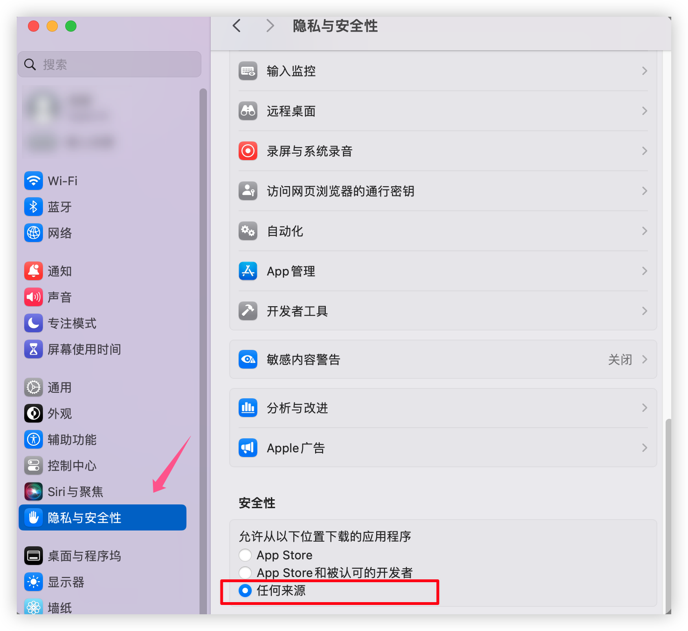
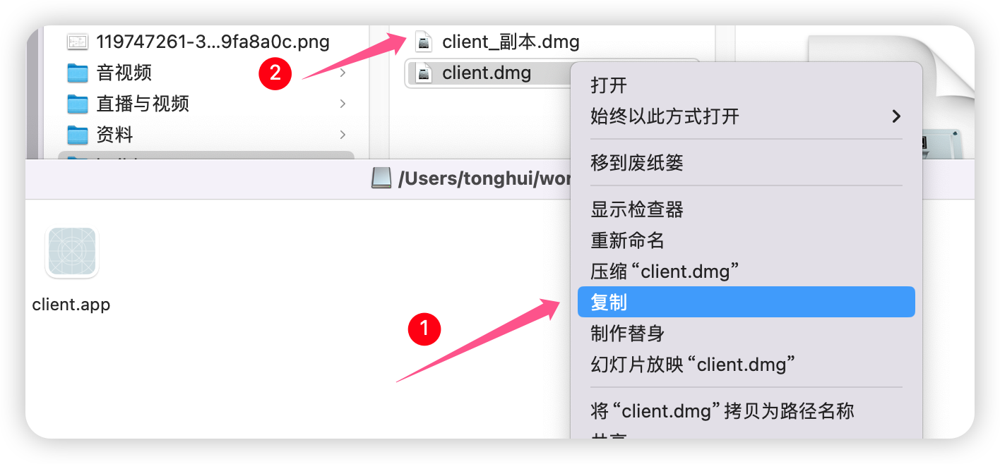
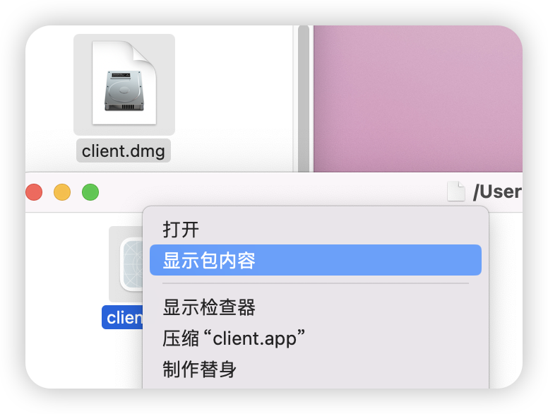
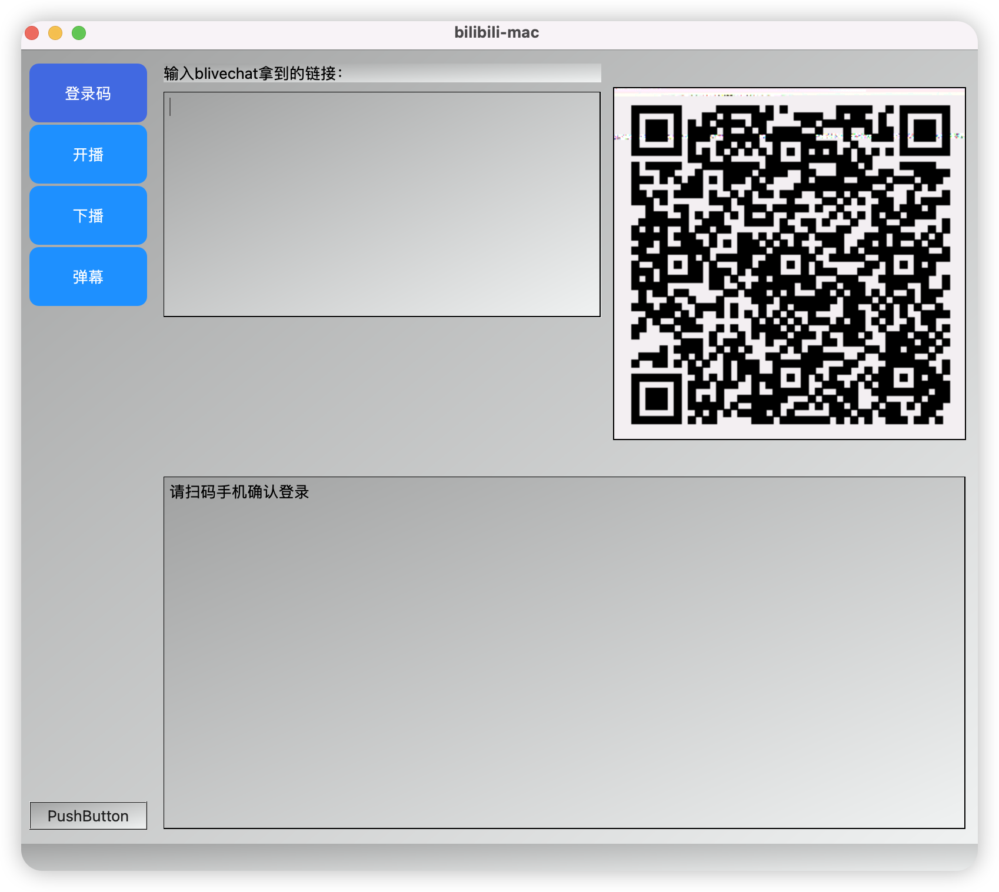
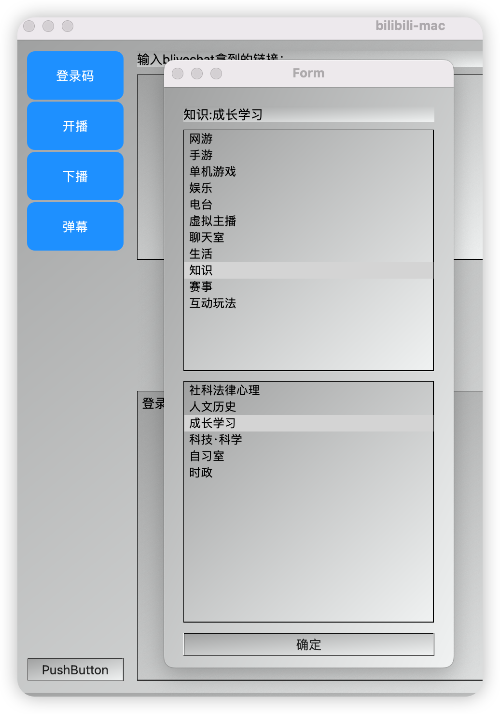
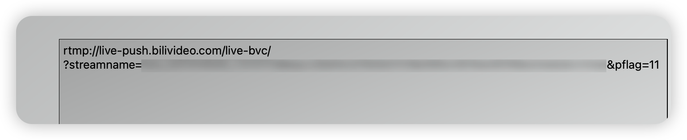
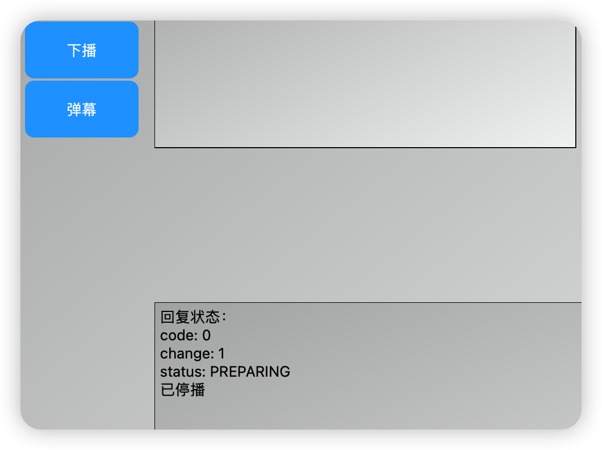
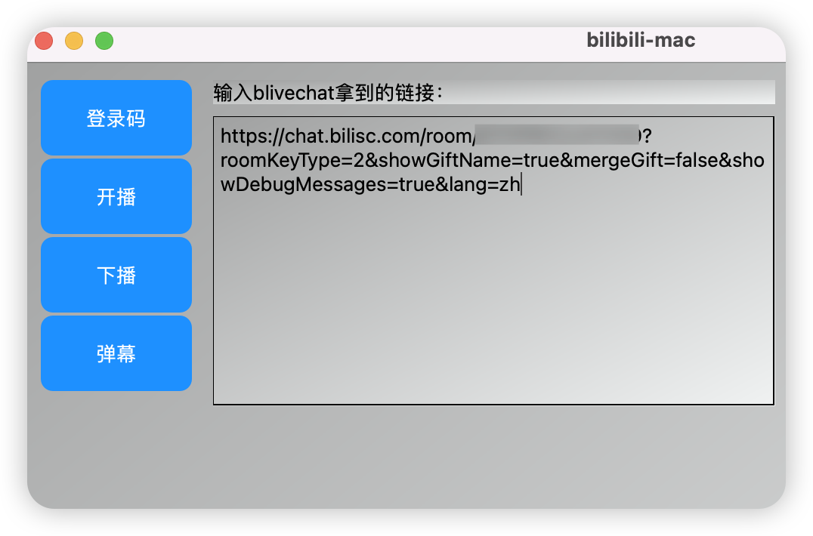
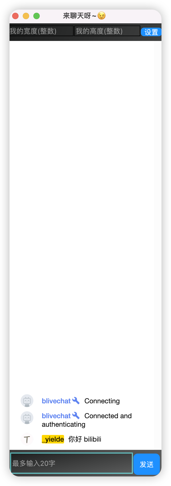

# bilibili-mac

一款基于C++ QT的跨平台软件（UI毛坯风格），PS：主要是mac没找到类似win直播姬的客户端（windows直接用官方的直播姬就好啦）
实现功能：

- [x] 扫码登录
- [x] 选取直播区，开播获取推流码
- [x] 关闭直播
- [x] 弹幕窗口
  - [x] 接收弹幕
  - [x] 发送弹幕

# 使用

**注：我没有开发者证书，打开dmg会显示文件无法运行或已损坏，请执行命令**

`sudo spctl --master-disable`，然后隐私与安全会显示**任何来源**，选择任何来源，就可以打开client啦~，如果还不行接着看下面

右键client.dmg，点击复制，然后双击client_副本.dmg，打开后看到client.app。

终端输入 `xattr -cr `空格，然后将client.app拖入终端，终端如下：

`xattr -cr /Volumes/\:Users\:tonghui\:workspace\:bilibili-mac\:client/client.app` ,后面再进去打开client就可以啦~

1. 打开编译好的client.dmg

打包的链接(macos): 

https://pan.baidu.com/s/1iRfPR0o-YFdxzhfXMKkznA?pwd=62gv 提取码: 62gv 

打包的链接(windows)，windows不存在mac的权限问题，直接使用:
通过百度网盘分享的文件：bilibili-build-share-win11.zip
链接：https://pan.baidu.com/s/1BSrHZDrgK4_DbnTGbdrEpQ?pwd=48ou 提取码：48ou 

右键client.app ->显示包内容->Contents->MacOS->双击运行client

2. 点击登录码，手机扫码

3. 点击开播（扫码后下次再使用cookie过期之前无序再登录，直接开播即可），选择开播区域

获取到推流码

填入OBS（OBS->设置->直播）

OBS点击开始直播即可

3. 点击下播

4. 弹幕交流

将blivechat生成的链接粘贴到这里，然后点击弹幕

## 开箱即用

打包的链接(macos): 

通过网盘分享的文件：bilibili-build-share-mac
链接: https://pan.baidu.com/s/1iRfPR0o-YFdxzhfXMKkznA?pwd=62gv 提取码: 62gv 

打包的链接(windows)，windows不存在mac的权限问题，直接使用:

通过百度网盘分享的文件：bilibili-build-share-win11.zip
链接：https://pan.baidu.com/s/1BSrHZDrgK4_DbnTGbdrEpQ?pwd=48ou 提取码：48ou 

# 鸣谢

特别感谢：

1. 感谢 https://github.com/HellOwhatAs/bili_rtmp 提供的诸多思路与实现
1. 感谢 https://github.com/xfgryujk/blivechat 不仅提供了弹幕获取，还开放免费的平台给大家用

# 框架

1. QT6.6.2

2. C++版本>=11
3. QR-Code-generator：https://github.com/nayuki/QR-Code-generator

# 声明

* 项目遵循CC-BY-NC 4.0协议：

  * 署名 — 您必须给出 适当的署名 ，提供指向本许可协议的链接，同时 标明是否（对原始作品）作了修改 。

  * 您可以用任何合理的方式来署名，但是不得以任何方式暗示许可人为您或您的使用背书。

    非商业性使用 — 您不得将本作品用于 商业目的。

* 项目仅用于研究学习