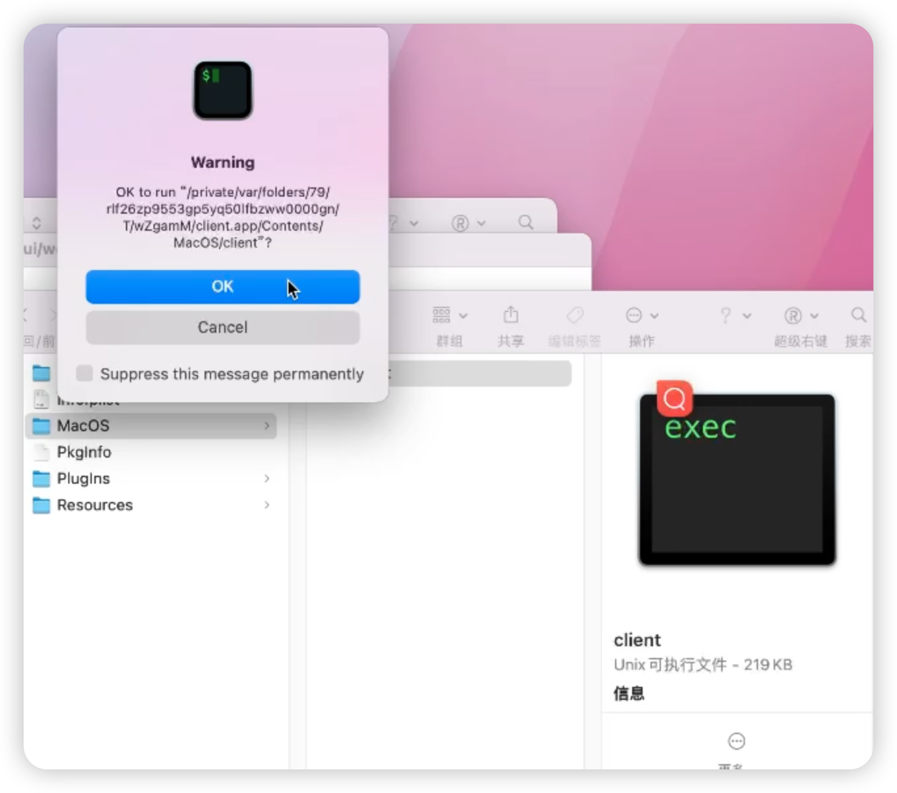
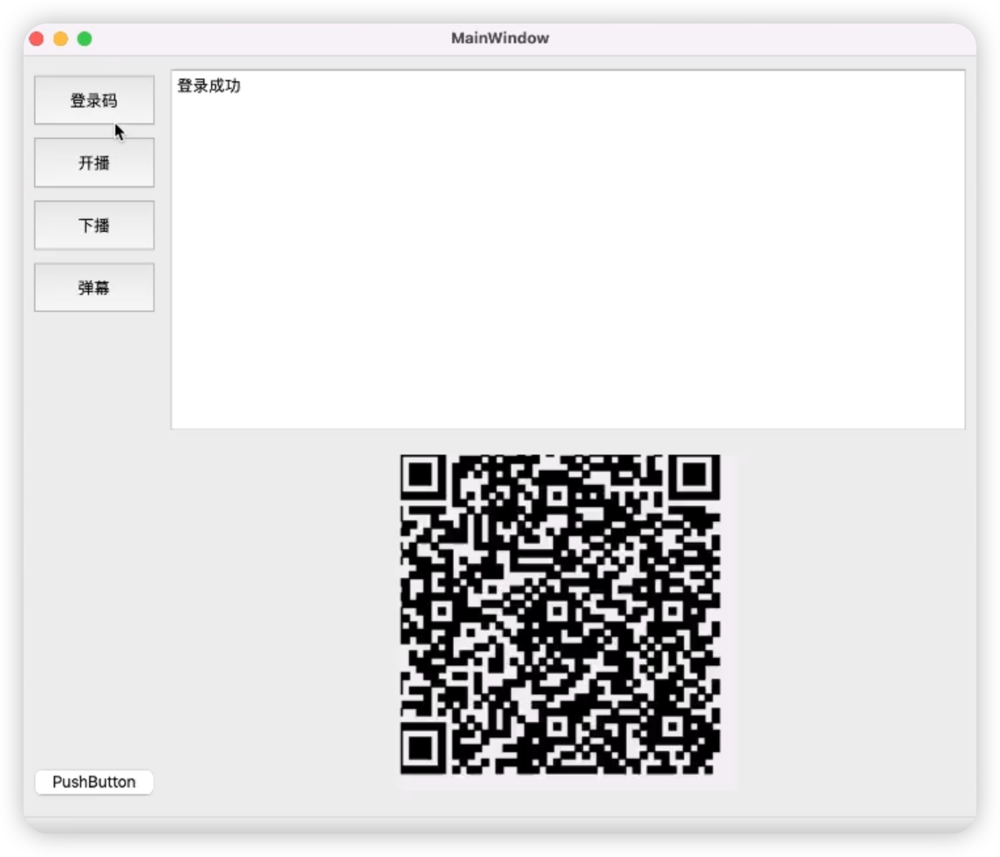
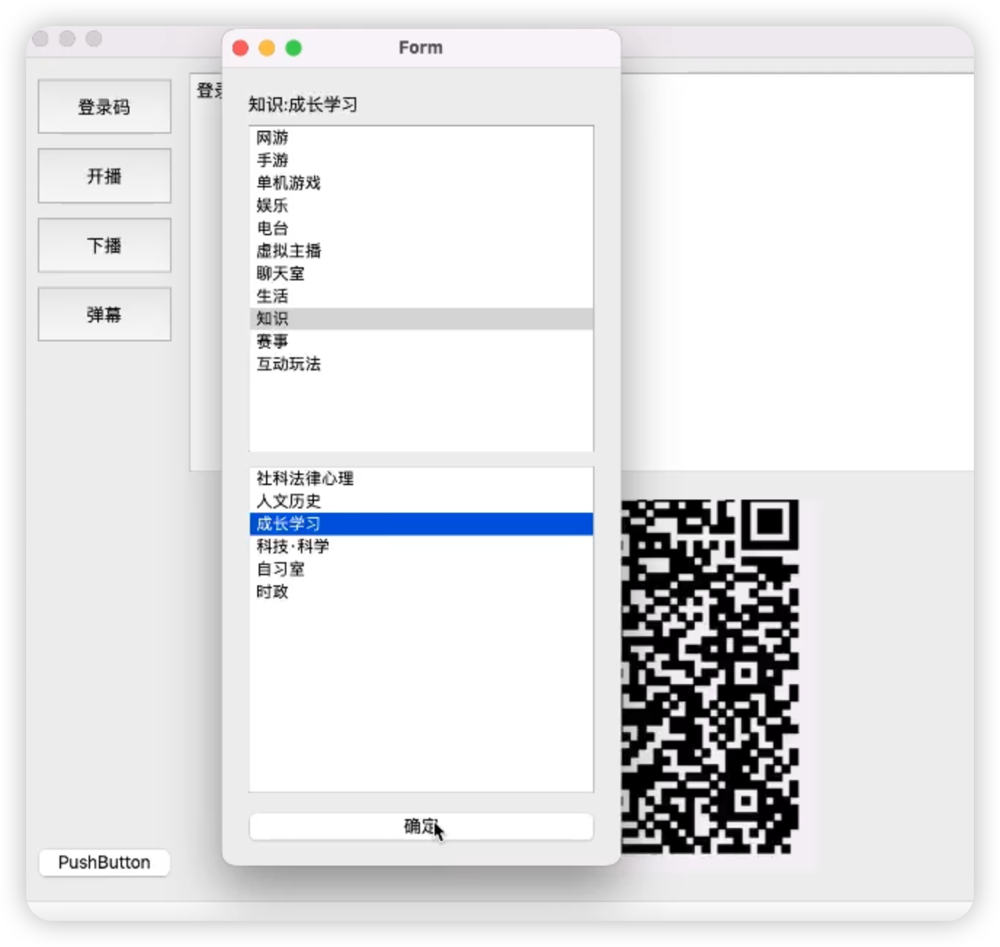
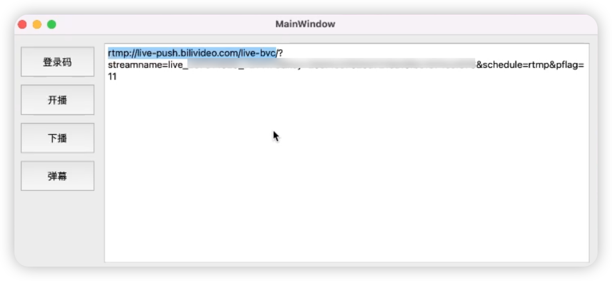
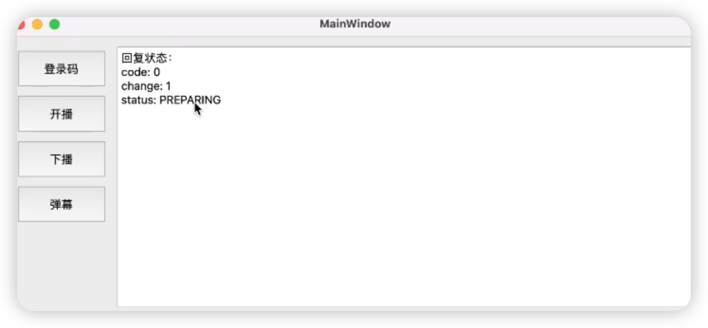

# bilibili-mac

一款基于C++ QT的跨平台软件（UI毛坯风格），PS：主要是mac没找到类似win直播姬的客户端（windows直接用官方的直播姬就好啦）
实现功能：

- [x] 扫码登录
- [x] 选取直播区，开播获取推流码
- [x] 关闭直播
- [ ] 弹幕窗口
  - [ ] 接收弹幕
  - [ ] 发送弹幕

# 使用

1. 打开仓库里的client.dmg，或者用QT编译

右键client.app ->显示包内容->Contents->MacOS->双击运行client

2. 点击登录码，手机扫码

3. 点击开播（扫码后下次再使用cookie过期之前无序再登录，直接开播即可），选择开播区域

获取到推流码

填入OBS：第一行的问号去掉，第二行streamname前加问号

OBS点击开始直播即可

3. 点击关播

# 鸣谢

特别感谢：

1. 感谢 https://github.com/HellOwhatAs/bili_rtmp 提供的诸多思路与实现

# 框架

1. QT6.6.2

2. C++版本>=11
3. QR-Code-generator：https://github.com/nayuki/QR-Code-generator

# 声明

* 项目遵循CC-BY-NC 4.0协议：

  * 署名 — 您必须给出 适当的署名 ，提供指向本许可协议的链接，同时 标明是否（对原始作品）作了修改 。

  * 您可以用任何合理的方式来署名，但是不得以任何方式暗示许可人为您或您的使用背书。

    非商业性使用 — 您不得将本作品用于 商业目的。

* 项目仅用于研究学习